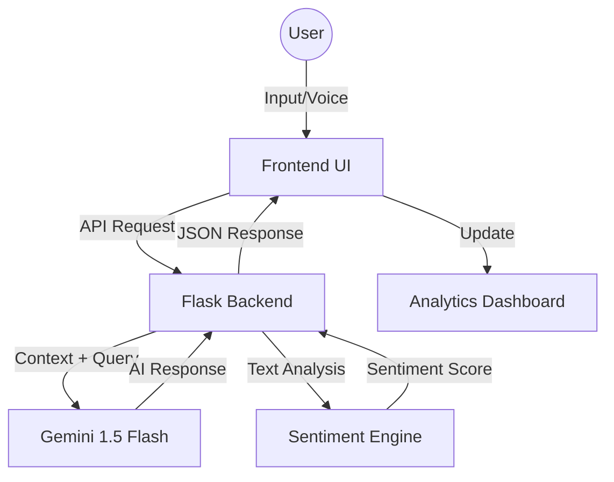

# <p align="center">🤖 Nexa AI Chatbot</p>

<p align="center">
  
  
  
  
  <br>
  
  
  
</p>

Nexa is a **next-generation, multimodal AI assistant** that combines the power of **Google Gemini 1.5 Flash** with a high-end, glassmorphic user interface. Designed for intelligence, speed, and emotional awareness, Nexa offers real-time sentiment analysis and deep analytics, making it perfect for both personal use and business integration.

---

## 📑 Table of Contents
- [✨ Key Features](#-key-features)
- [🧠 Intelligence & Sentiment](#-intelligence--sentiment)
- [🎨 Design Philosophy](#-design-philosophy)
- [🚀 Tech Stack](#-tech-stack)
- [🛠️ Installation & Setup](#-installation--setup)
- [📁 Project Structure](#-project-structure)
- [🔗 System Flow](#-system-flow)
- [🌟 Future Roadmap](#-future-roadmap)

---

## ✨ Key Features

| Category | Feature | Description |
| :--- | :--- | :--- |
| **AI CORE** | **Gemini 1.5 Flash** | High-speed, context-aware responses with deep reasoning. |
| **EMOTION** | **Sentiment Engine** | Integrated VADER NLP for emotional tone detection. |
| **VISUALS** | **Glassmorphism UI** | Translucent panels, mesh gradients, and premium animations. |
| **MULTIMODAL** | **File Intelligence** | Analyzes images, ZIP files, and generates visual content. |
| **ANALYTICS** | **Live Metrics** | Interactive Chart.js dashboard for usage and mood trends. |
| **VOICE** | **Hands-Free AI** | Integrated Speech-to-Text and AI Voice synthesis. |

---

## 🧠 Intelligence & Sentiment

Nexa doesn't just process text; it **understands context and mood**.

- **Sentiment Awareness**: Every interaction is analyzed for emotional weight. The AI adapts its tone based on your sentiment (Positive, Negative, or Neutral).
- **Multimodal Reasoning**: Upload an image or a ZIP file, and Nexa will analyze the contents, providing summaries, code explanations, or data insights.
- **Contextual Memory**: Remembers past interactions within a session for coherent, multi-turn conversations.

---

## 🎨 Design Philosophy

We believe that a powerful AI deserves a **Premium Environment**.

- **Modern Glassmorphism**: Leveraging `backdrop-filter` and `rgba` transparency for a sleek, aero-look.
- **Vibrant Gradients**: High-contrast mesh gradients that breathe life into the dark workspace.
- **Micro-Animations**: Transitions and hover states are tuned to 300ms for a "snappy" yet fluid feel.
- **Adaptive Layout**: Fully responsive design that scales from desktop to mobile screens seamlessly.

---

## 🚀 Tech Stack

### Backend Power
- **Engine**: Python / Flask
- **Security**: Flask-Login, Werkzeug
- **Automation**: Google GenAI SDK (Gemini API)
- **Data**: JSON-based persistent storage

### Frontend Excellence
- **Logic**: Vanilla JavaScript (ES6+)
- **Visuals**: CSS3 Custom Design System (Strict No-Framework)
- **Charts**: Chart.js 4.0
- **Markdown**: Marked.js for AI response formatting

---

## 🛠️ Installation & Setup

### 1️⃣ Clone the Repository
```bash
git clone https://github.com/Jeetbaraiya/DEXTER-AI.git
cd amdox-ai-chatbot
```

### 2️⃣ Configure Environments
Create a `.env` file in the root directory:
```env
GEMINI_API_KEY=AIzaSy...your_key
SECRET_KEY=yoursecretphrase
```

### 3️⃣ Install Dependencies
```bash
pip install -r requirements.txt
```

### 4️⃣ Launch DEXTER
```bash
python app.py
```
> [!IMPORTANT]
> Once the server starts, you can access the chatbot at:
> **URL**: [http://localhost:5000](http://localhost:5000)

> [!TIP]
> Use the default admin credentials to access the analytics dashboard:
> **User**: `admin` | **Pass**: `admin123`

---

## 🔗 System Flow



---

## 🌟 Future Roadmap

- [ ] **Database Migration**: Move from JSON to PostgreSQL for enterprise-level scaling.
- [ ] **Vector Search**: Implement Pinecone/FAISS for long-term knowledge retrieval (RAG).
- [ ] **Auth Expansion**: Add OAuth2 integration (Google/Github login).
- [ ] **Mobile App**: Dedicated Android/iOS application using React Native.

---

## 👨‍💻 Author
Built with ❤️ by the **Nexa Development Team**. 

---

## 📄 License
This project is licensed under the MIT License - see the [LICENSE](LICENSE) file for details.
